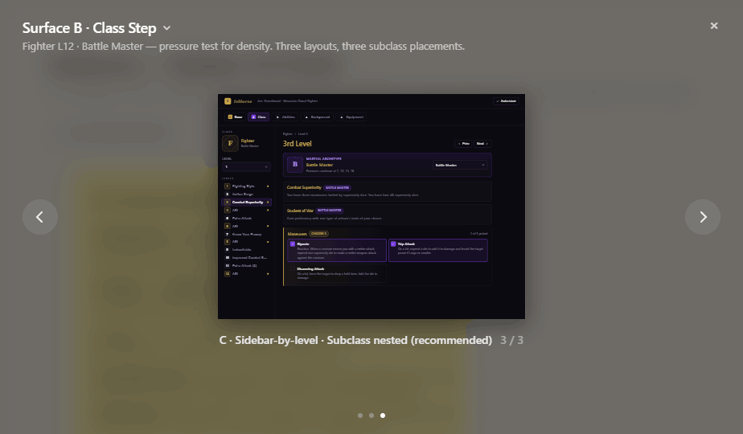
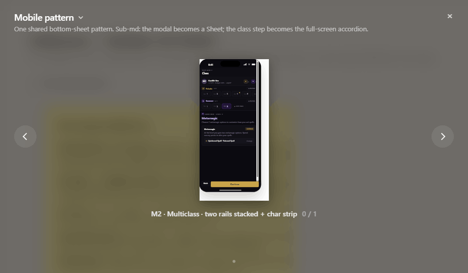

# Inkborne

A character and campaign workspace for tabletop role-playing groups, starting
with D&D 5e (2014). Bring character building, play-state tracking, homebrew, and
campaign stories into one place.

**Status: alpha.** The repository contains substantial implemented workflows,
but operational acceptance and content/licensing review remain open. It is not
a turnkey public release. See [Known limitations](#known-limitations).

## The problem

Players and game masters often split character rules, session state, homebrew,
and campaign notes across different tools. Inkborne aims to keep the mechanical
sheet and the story connected, while giving each person access only to the
content and campaign material they are entitled to see.

## My contribution

I led product definition and AI-assisted delivery: writing requirements,
shaping the product vision, features, and user experience, seeking feedback,
and prioritizing value against the time and resources available. I reviewed
design directions and sequenced work around character creation, actual play,
and feedback checkpoints. Coding agents assisted implementation, and
engineering decisions were made collaboratively.

The project demonstrates product direction, scope management, and iterative
AI-assisted development. The rules engine and import parser use deterministic
logic.

## Implemented workflows

- **Build and play a character:** responsive builder and sheet, multiclass and
  level-up flows, inventory, spell casting, dice/roll history, resources, rests,
  effects, and concentration.
- **Connect mechanics and narrative:** character backstories, timelines and
  relationships alongside campaign membership, roles, a wiki, and backlinks.
- **Browse entitled content:** a searchable player/GM compendium, with private,
  platform, and campaign-shared material handled through access boundaries.
- **Create homebrew:** spell, feat, and background authoring with immutable
  versions, campaign-scoped sharing, and pinned character references.
- **Review imports:** static MPMB script parsing, supported repair choices,
  conflict resolution, provenance, and calculation preview before publication.
- **Collect feedback:** authenticated feedback capture and administrative triage.

For milestone-level detail, see the [roadmap](docs/ROADMAP.md). Historical
verification counts in project documents are snapshots, not a claim that every
current environment has been retested.

## Product decisions and tradeoffs

- **Playable depth before breadth.** Start with one ruleset and a coherent
  character-building/play loop. Additional systems, content types, and broad
  public publishing remain later work.
- **Flexible content with stable characters.** Content-as-data enables homebrew;
  immutable versions and exact pins keep an edit from silently changing a
  character already in play.
- **Sharing with boundaries.** Campaign access and DM controls are separate
  from public publishing. Existing character pins and revocation behavior need
  explicit rules rather than a single global sharing switch.
- **Reviewable imports.** Imported scripts are parsed statically instead of
  executed. Unsupported or ambiguous mechanics need review rather than a
  promise that every script will work.
- **Feedback before a broad launch.** Alpha checkpoints and an in-app feedback
  path support learning before further expanding scope.

## Design examples

These existing repository images are **design mockups**, not screenshots of a
freshly tested live deployment. They illustrate the class-step and mobile
multiclass design direction. Game-text and asset provenance still require the
review described in [Content and licensing](docs/CONTENT_AND_LICENSING.md).





## Stack

TypeScript, Next.js 16, React 19, Tailwind CSS, Base UI, and Supabase
(Postgres/Auth/Storage). Vitest covers unit/component behavior; Playwright
provides authenticated browser acceptance flows.

## Local development

Prerequisites: Node.js 22 or later, npm, and a **disposable development Supabase
project**. Docker and the Supabase CLI are needed if you run Supabase locally.
Use [Supabase's local development guide](https://supabase.com/docs/guides/local-development).

```sh
git clone https://github.com/EzekielTheMad/Inkborne.git
cd Inkborne
npm ci
cp .env.local.example .env.local
```

1. Configure your own development project in `.env.local` using the names in
   [.env.local.example](.env.local.example). Keep the service-role key server-side;
   never put it in a `NEXT_PUBLIC_` variable or commit it.
2. Apply the repository's [migrations](supabase/migrations) in order and its
   [seed](supabase/seed.sql) to that disposable project. The seed registers the
   game system; it does not provide a complete playable catalog. Fresh-project
   bootstrap has not been revalidated as part of this documentation update.
3. Configure Auth redirect URLs for your local origin and create your own
   isolated test users. Provider consent/linking needs separate configuration
   and testing. There is no shared public demo login.
4. Supply only game content you have permission to use. The optional
   `npm run import:srd` importer requires the URL and service-role variables in
   its process environment, fetches upstream content, and writes the catalog.
   Review [content provenance](docs/CONTENT_AND_LICENSING.md) first; do not point
   it at production as a setup experiment.
5. Start the app:

```sh
npm run dev
```

Open `http://localhost:3000`. Database migrations, imports, and authenticated
browser tests can write data; keep all of them on the disposable environment.

## Verification

```sh
npm run check   # TypeScript, strict ESLint, and Vitest
npm run build   # Next.js production build
```

[CI](.github/workflows/ci.yml) runs those application gates. Browser tests are a
separate gate:

```sh
npx playwright install chromium
npm run test:e2e
```

Playwright requires a configured development backend and private test-user
variables. It creates and cleans up test records. Read the
[test-account guidance](docs/TEST_ACCOUNTS.md) before running it; do not reuse
historical login details from repository history. A successful build is not
proof of provider consent, deployed RLS, backup recovery, or production safety.

## Known limitations

- Closed-alpha operational work still includes backup deployment/restore
  acceptance, the account-linking consent matrix, and final administrative
  feedback review. Check the roadmap for the current owner-verified status.
- Only the initial ruleset and supported homebrew/import shapes are implemented.
  PDF import, additional content types, optional live presence, and public-beta
  polish remain roadmap work.
- The repository has no root software license yet. Game text, imported scripts,
  design examples, and other third-party material need a provenance/attribution
  review before broader distribution.
- Historical documents contained reusable test-login details. Removing them
  from current files does not revoke the account or remove older Git objects.
  Account containment remains a separate owner action.

## Content and licensing

No project-wide software license has been selected in this change. The code,
D&D/SRD text, imported homebrew, and design assets have distinct rights and
attribution requirements. Do not infer a license grant from repository
visibility. See [Content and licensing](docs/CONTENT_AND_LICENSING.md) for the
review checklist and source links.
